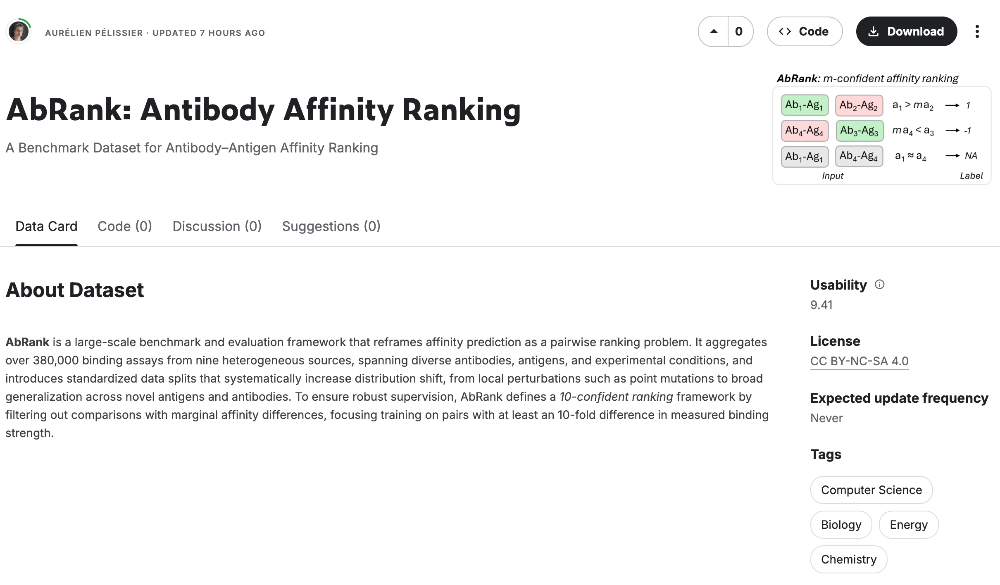
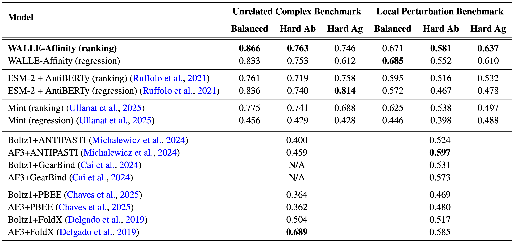

# WALLE-Affinity (WAFFLE)

This repository is the official implementation of **W**a**LL**e-**AFF**inity (WAFFLE),
integrating both Graph and Protein Language information for antibody-antigen
affinity prediction framed as both ranking and regression question. Check out
paper [AbRank: A Benchmark Dataset and Metric-Learning Framework for Antibody–Antigen Affinity Ranking](https://openreview.net/) (under review).

## Requirements

To create a conda environment with all the dependencies, run the following commands:

```setup
# create a conda environment with the dependencies
conda update -f ./conda-env/waffle-gpu.yaml

# install waffle
pip install -e .
```

Copy and adjust the environment variables in the `.env` file.

```sh
cp .env.example .env
```

In .env you need to set the following variables:

```sh
ROOT_DIR=""  # the root directory of the project e.g. /workspace/AbRank-WALLE-Affinity
RUNS_PATH=""  # the path to the runs folder e.g. /workspace/AbRank-WALLE-Affinity/runs
DATA_PATH=""  # the path to the data folder e.g. /workspace/AbRank-WALLE-Affinity/data/local

# if you use wandb for logging
WANDB_PROJECT=""  # your wandb project name
WANDB_ENTITY=""  # your wandb entity
WANDB_API_KEY="" # your wandb api key obtained from wandb your profile page
```

NOTE: the environment variable `DATA_PATH` is used to set the `ROOT` path
argument of the dataset objects.

## Dataset

### Predicted Antibody and Antigen Structures

Predicted antibody and antigen structures are available on Kaggle accessible at
[AbRank: Antibody Affinity Ranking](https://www.kaggle.com/datasets/aurlienplissier/abrank).

Brief overview of the dataset:



### Pre-computed Embeddings

To train WAFFLE, you will need to pre-download the pre-computed embeddings for
the antibodies and antigens to a the folder
`./data/local/AbRank/processed/ca_10/pairdata`.

Download [pairdata.tar.gz]() and decompress the tarball to
`./data/local/AbRank/processed/ca_10/pairdata/`.

### Splits

The processed split files will be automatically downloaded on the first run of the
`AbRankDataset` class.

Ranking splits:

```python
from waffle.data.components.abrank_dataset import AbRankDataset

dataset = AbRankDataset(root="./data/local")
```

Regression splits:

```python
from waffle.data.components.abrank_dataset_regression import AbRankDatasetRegression

dataset = AbRankDatasetRegression(root="./data/local")
```

Both will create a folder called `AbRank` under `./data/local/AbRank` and do
the following:

- `./data/local/AbRank/raw`: contain the downloaded tarballs
- `./data/local/AbRank/processed`: the pre-processed splits as csv files

## Training

To train the model(s), refer to the commands inlcuded in the `Makefile`.

We use `hydra` to manage the configuration files. To adjust hyperparameters, please refer to the `./waffle/config` folder.

For affinity RANKING tasks:

```train
# load the environment variables
source ./.env

# train the models under different settings
# 1. Balanced
train-abrank-ranking-balanced-train-swapped
# 2. Hard Ab
train-abrank-ranking-hard-ab-train-swapped
# 3. Hard Ag
train-abrank-ranking-hard-ag-train-swapped
```

For affinity REGRESSION tasks:

```train
# load the environment variables
source ./.env

# train the models under different settings
# 1. Balanced
train-abrank-regression-balanced-train-swapped
# 2. Hard Ab
train-abrank-regression-hard-ab-train-swapped
# 3. Hard Ag
train-abrank-regression-hard-ag-train-swapped
```

## Evaluation

To evaluate my model on ImageNet, run:

```eval
python eval.py --model-file mymodel.pth --benchmark imagenet
```

## Results

The following is the benchmarking results reported in the paper.



## Citation

> Under review, coming soon.
